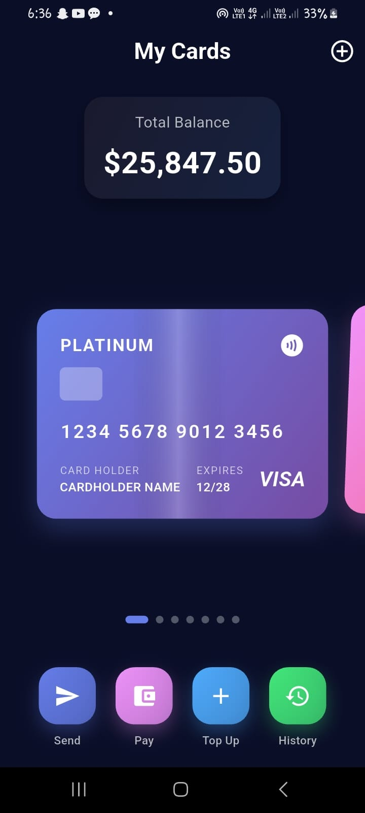
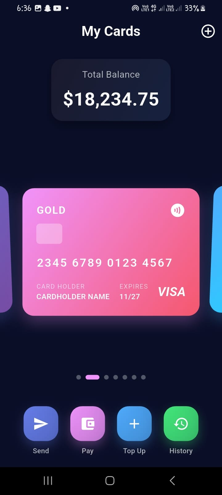

# 💳 Swipeable Credit Cards – Flutter

A beautifully designed **credit card UI app** built with Flutter, featuring smooth swipe animations, elegant gradients, and shimmer effects for a premium feel.

This app demonstrates **realistic credit card interactions** with fluid transitions, making it ideal for **banking apps, fintech dashboards, or wallet apps**.

---

## 📱 Screenshots

<div align="left">
  
  
  
</div>  

---

##  Features

*  **7 Premium Card Designs** – Platinum, Gold, Emerald, Sapphire, Titanium, Diamond, and Black
*  **Smooth Swipe Animation** – Horizontal swiping with 3D rotation
*  **Beautiful Gradients** – Eye-catching color combinations
*  **Shimmer Effects** – Animated light reflections across cards
*  **Real-time Balance Display** – Elastic animation updates
*  **Interactive UI** – Quick action buttons & card indicators
*  **Responsive Layout** – Works on all screen sizes

---

##  Getting Started

1. **Clone the repo**

   ```bash
   git clone https://github.com/yourusername/swipeable_credit_cards
   cd swipeable_credit_cards
   ```

2. **Install dependencies**

   ```bash
   flutter pub get
   ```

3. **Run the app**

   ```bash
   flutter run
   ```


---

##  Tech Stack

* Flutter 
* Dart 

